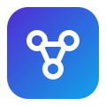

<p align="center">
  
</p>

<h1 align="center">NetCoreAI</h1>

<p align="center">
  <strong>Turn any existing ASP.NET Core app into an AI-enabled application — local models, RAG, tools and agents, with two lines of code.</strong>
</p>

<p align="center">
  <a href="LICENSE"></a>
  
  
  <a href="CONTRIBUTING.md"></a>
</p>

---

> **Status:** early development. The API surface and package names described below are the target design and will change until the first `0.x` release. Star or watch the repo to follow along, and open a Discussion if you want to help shape it.

## What is NetCoreAI?

NetCoreAI is a NuGet-distributed framework that mounts a complete AI platform inside your existing ASP.NET Core application — think **Hangfire for AI**. Add the package, map the endpoint, open the dashboard.

```csharp
builder.Services.AddNetCoreAI().AddGgufBackend().AddOnnxBackend();
app.MapNetCoreAI();   // dashboard + APIs at /netcoreai
```

From there you get:

- **Model Hub** — browse Hugging Face from the dashboard, download GGUF / ONNX / Safetensors models with resumable, verified downloads, or import from disk for air-gapped installs.
- **Local model management** — hardware detection, "will it fit" checks, load/unload, aliases, per-model defaults, idle unloading.
- **Remote providers as peers** — Ollama, any OpenAI-compatible endpoint (OpenAI, Azure, vLLM, LM Studio, Groq, DeepSeek, OpenRouter…) and Anthropic, all selectable next to local models with mixed fallback chains.
- **Chat playground** — streaming chat with any model, parameter tuning, saved conversations.
- **RAG knowledge bases** — ingest files, SQL tables, REST endpoints or documents pushed from your own code; chunk, embed, retrieve with citations and per-user ACL filtering. SQLite vector store out of the box, Postgres/Qdrant optional.
- **Tool designer** — your existing controllers and minimal-API endpoints are auto-discovered and can be exposed to models as tools in minutes, with locked parameters and identity propagation.
- **Agent builder** — compose model + prompt + tools + knowledge bases into agents, test them with full traces, then call them from C# (`IAgentClient`) or HTTP (JSON / SSE).
- **Local-first, no external services** — no Python, no Docker, no separate server, no cloud account required. Everything runs in your process.

All model access goes through [`Microsoft.Extensions.AI`](https://learn.microsoft.com/dotnet/ai/microsoft-extensions-ai) abstractions (`IChatClient`, `IEmbeddingGenerator`), so your application code never depends on a specific runtime or vendor.

## Quick start

> Requires the [.NET 10 SDK](https://dotnet.microsoft.com/download).

**1. Install**

```bash
dotnet add package NetCoreAI
dotnet add package NetCoreAI.Backend.Gguf          # runs GGUF models via LLamaSharp
dotnet add package NetCoreAI.Backend.Onnx          # runs ONNX models via ONNX Runtime GenAI
```

**2. Register**

```csharp
// Program.cs
builder.Services.AddNetCoreAI(o =>
{
    o.DataDirectory = "./netcoreai";                      // models, vectors, metadata
    o.Dashboard.Authorization = p => p.RequireRole("Admin");
})
.AddGgufBackend()
.AddOnnxBackend()
.AddSqliteVectorStore();

app.MapNetCoreAI();
```

**3. Open the dashboard** at `https://localhost:5001/netcoreai`, go to **Model Hub**, download a small chat model (a curated list shows what fits your hardware), and start chatting.

**4. Use it from code**

```csharp
public class InvoiceSummarizer(IChatClient chat)
{
    public async Task<string> SummarizeAsync(string text)
        => (await chat.GetResponseAsync($"Summarize this invoice:\n{text}")).Text;
}
```

Or call an agent you designed in the dashboard:

```csharp
public class SupportBot(IAgentClient agents)
{
    public IAsyncEnumerable<AgentEvent> AskAsync(string question, ClaimsPrincipal user)
        => agents.RunStreamingAsync("support-agent", new AgentRequest(question, user));
}
```

## Packages

| Package | Purpose |
|---|---|
| `NetCoreAI` | Meta-package: Core + Dashboard + SQLite storage |
| `NetCoreAI.Abstractions` | Interfaces and records only; reference this from libraries |
| `NetCoreAI.Core` | Model registry, hardware probe, downloader, RAG pipeline, tool & agent engine |
| `NetCoreAI.Dashboard` | Embedded management UI and management API |
| `NetCoreAI.Client` | `IAgentClient`, `IKnowledgeClient` — in-process or over HTTP |
| `NetCoreAI.Backend.Gguf` | LLamaSharp provider; `.Cuda12` / `.Vulkan` add GPU native backends |
| `NetCoreAI.Backend.Onnx` | ONNX Runtime GenAI provider (CPU / DirectML / CUDA) |
| `NetCoreAI.Backend.Safetensors` | Convert-on-import (to GGUF/ONNX) and, later, native execution |
| `NetCoreAI.Backend.Ollama` | Ollama provider (local or LAN) |
| `NetCoreAI.Backend.OpenAICompatible` | OpenAI, Azure OpenAI and any OpenAI-compatible server |
| `NetCoreAI.Backend.Anthropic` | Anthropic Messages API (Claude) |
| `NetCoreAI.VectorStore.Sqlite` / `.Postgres` / `.Qdrant` | Vector stores |
| `NetCoreAI.Storage.Sqlite` / `.SqlServer` / `.Postgres` | Metadata storage |

## Architecture

```
┌───────────────────────────────────────────────────────────────────┐
│ Dashboard UI (Blazor)   │   Agent HTTP API   │   C# Client SDK     │
├───────────────────────────────────────────────────────────────────┤
│ Agent Engine  │ Tool Registry  │ RAG Pipeline  │ Chat Sessions     │
├───────────────────────────────────────────────────────────────────┤
│ Model Registry │ Model Hub (HF) │ Hardware Probe │ Download Manager│
├───────────────────────────────────────────────────────────────────┤
│ IModelProvider: ONNX │ GGUF │ Safetensors │ Ollama │ OpenAI │ Anthropic │
├───────────────────────────────────────────────────────────────────┤
│ Storage: metadata DB │ vector store │ file store                   │
└───────────────────────────────────────────────────────────────────┘
```

Every provider, vector store, document extractor and data source is a separate project behind a documented interface, with a conformance test suite so contributors can add one without touching Core. See [`docs/requirements/NetCoreAI-Requirements.md`](docs/requirements/NetCoreAI-Requirements.md) for the full specification, [`docs/plans/`](docs/plans/) for the per-phase development plans, [`docs/adr/`](docs/adr/) for design decisions and [`docs/guides/`](docs/guides/) for how-to guides.

## Supported platforms

| OS | CPU | GPU |
|---|---|---|
| Windows x64 | ✅ | DirectML, CUDA 12 |
| Linux x64 | ✅ | CUDA 12, Vulkan |
| macOS arm64 | ✅ | Metal |
| Windows arm64 (NPU) | planned | planned |

Runs under Kestrel, IIS, Docker and Azure App Service (CPU). GPU acceleration requires the matching backend package (e.g. `NetCoreAI.Backend.Gguf.Cuda12`).

## Roadmap

| Phase | Scope | Status |
|---|---|---|
| 1 — Foundation | Providers (GGUF, ONNX, Ollama, OpenAI-compatible, Anthropic), hardware probe, Model Hub, chat playground, dashboard shell | 🚧 in progress |
| 2 — Knowledge | Knowledge bases, file/SQL/API/code data sources, ingestion pipeline, document chat with citations | ⏳ |
| 3 — Tools & Agents | Endpoint discovery, tool designer, agent builder, `IAgentClient`, HTTP run API, API keys, OpenTelemetry | ⏳ |
| 4 — Hardening | Safetensors convert-on-import, hybrid search + re-ranking, guardrails, versioning, audit, multi-tenant, OpenAI-compatible endpoint | ⏳ |
| 5 — Expansion | Native Safetensors runtime, MCP in/out, multi-agent, vision input, more connectors | ⏳ |

Track progress on the [project board](../../projects).

## Repository layout

The framework and the example applications are kept in **separate solutions** so the framework never carries sample dependencies, and the samples consume NetCoreAI exactly the way a real user would — as NuGet packages.

```
NetCoreAI/
├── NetCoreAI.slnx                     # framework only
├── src/
│   ├── NetCoreAI.Abstractions/
│   ├── NetCoreAI.Core/
│   ├── NetCoreAI.Dashboard/
│   ├── NetCoreAI.Client/
│   ├── Backends/
│   │   ├── NetCoreAI.Backend.Gguf/
│   │   ├── NetCoreAI.Backend.Onnx/
│   │   ├── NetCoreAI.Backend.Safetensors/
│   │   ├── NetCoreAI.Backend.Ollama/
│   │   ├── NetCoreAI.Backend.OpenAICompatible/
│   │   └── NetCoreAI.Backend.Anthropic/
│   ├── VectorStores/
│   │   ├── NetCoreAI.VectorStore.Sqlite/
│   │   ├── NetCoreAI.VectorStore.Postgres/
│   │   └── NetCoreAI.VectorStore.Qdrant/
│   └── Storage/
│       ├── NetCoreAI.Storage.Sqlite/
│       ├── NetCoreAI.Storage.SqlServer/
│       └── NetCoreAI.Storage.Postgres/
├── tests/
│   ├── NetCoreAI.Core.Tests/
│   ├── NetCoreAI.Conformance/        # contract tests any provider/vector store can run
│   └── NetCoreAI.Integration.Tests/
├── samples/
│   ├── NetCoreAI.Samples.slnx         # examples only — references NetCoreAI via NuGet
│   ├── Directory.Build.props         # pins the NetCoreAI package version used by all samples
│   ├── MinimalApi/                   # smallest possible host
│   ├── MvcExistingApp/               # existing MVC app exposing its controllers as tools
│   ├── BlazorHost/                   # Blazor app with the embeddable chat widget
│   ├── RagDocuments/                 # knowledge base over PDFs + SQL table
│   └── DockerGpu/                    # docker-compose with CUDA backend
├── docs/
│   ├── requirements/
│   ├── adr/
│   └── guides/
├── build/                            # CI scripts, local NuGet feed config
├── Directory.Build.props             # SDK pin, central package management (framework)
├── Directory.Packages.props
└── global.json
```

Rules that keep the two apart:

- `NetCoreAI.slnx` contains only `src/` and `tests/`. It has no reference to anything under `samples/`.
- Samples never use `ProjectReference` into `src/`. They pull `NetCoreAI.*` packages from NuGet.org, or from the local feed produced by `dotnet pack` during development.
- Samples have their own `Directory.Build.props` that sets the package version, so bumping one line upgrades every example.
- CI builds and tests the framework first, packs it to `artifacts/packages/`, then builds the samples against that feed — so a sample that breaks is caught before release, but sample breakage never blocks a framework build.

## Building from source

**Framework**

```bash
git clone https://github.com/netcoreai/NetCoreAI.git
cd NetCoreAI
dotnet build NetCoreAI.slnx
dotnet test --solution NetCoreAI.slnx   # default suite needs no secrets; downloads a <500 MB test model on first run
dotnet pack  NetCoreAI.slnx -c Release -o artifacts/packages
```

**Samples** (against the packages you just packed, or against NuGet.org)

```bash
cd samples
dotnet nuget add source ../artifacts/packages --name netcoreai-local   # only for local development
dotnet build NetCoreAI.Samples.slnx
cd MinimalApi && dotnet run
# open https://localhost:5001/netcoreai
```

No private feeds, keys or services are needed to build. Provider tests for OpenAI/Anthropic run only when the corresponding environment variables are set.

## Contributing

Contributions are very welcome — providers, vector stores, document extractors, dashboard pages, docs and translations are all good entry points.

1. Read [`CONTRIBUTING.md`](CONTRIBUTING.md) for dev setup, coding standards and the PR checklist.
2. Look for issues labelled [`good first issue`](../../labels/good%20first%20issue) or [`help wanted`](../../labels/help%20wanted).
3. Breaking changes to `NetCoreAI.Abstractions` go through an RFC in [Discussions](../../discussions) first.

This project follows the [Contributor Covenant](CODE_OF_CONDUCT.md). Security issues: see [`SECURITY.md`](SECURITY.md).

## Privacy

NetCoreAI sends no telemetry. The only outbound connections are Hugging Face (when you use the Model Hub), provider connections you configure yourself, and the curated model manifest served from this repository. A single setting disables all remote access for air-gapped deployments.

## License

[MIT](LICENSE) © Masums. Built with [Microsoft.Extensions.AI](https://github.com/dotnet/extensions), [LLamaSharp](https://github.com/SciSharp/LLamaSharp), [ONNX Runtime GenAI](https://github.com/microsoft/onnxruntime-genai) and [OllamaSharp](https://github.com/awaescher/OllamaSharp). Model licences are shown in the Model Hub and remain the responsibility of the user.
